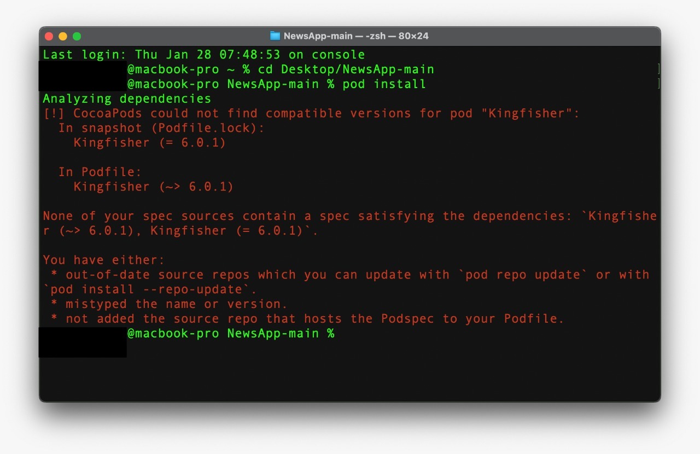

# NewsApp
iOS 14 Swift News.

A simple News App that shows the a few articles and its detail. The app was created using RxSwift in the MVVM architecture.

## Compatibility
This project is written in Swift 5 and requires Xcode 12.3+ & Cocoapods 1.9.3 to build and run.

## Getting Started
Navigate to the directory and run pod install. Then open NewsApp.xcworkspace to run the project:
```sh
cd NewsApp
pod install
open .
```
### CocoaPods
Se você encontrar o erro abaixo, o cocoapods do seu Mac está desatualizado. Execute o comando abaixo para atualizá-lo e instalar os pods:
```sh
cd NewsApp
pod install --repo-update
```


## Contact Info
renefx@gmail.com
